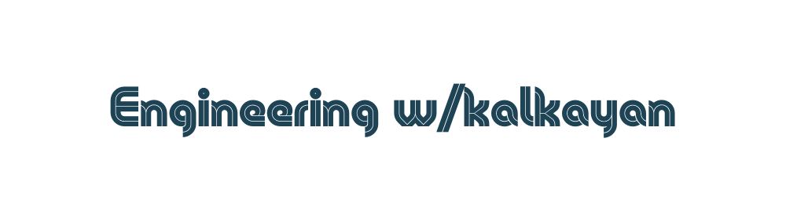

[](https://app.netlify.com/sites/inspiring-leakey-61b61f/deploys)

Welcome to the source repository of the website - [engineeringwith.kalkayan.io](https://engineeringwith.kalkayan.io/). This repository holds the content and configurations for building the website.  

## Introduction 

The Engineering w/kalkayan is predominant built with [hugo](https://gohugo.io/) and currently uses [seydoux](https://github.com/kalkayan/seydoux) as its theme.

### Develop the Website locally

Clone the fork of this repo and its submodules by using `--recurse-submodules` option, run:

```bash
git clone --recurse-submodules  git@github.com:{your_github}/engineeringwith.kalkayan.io.git
```

If you accidentally cloned this repository without --recurse-submodules flag, you can do the following to clone the submodules:

```bash
cd engineering.kalkayan.io && git submodule update --init
```

> TODO: confim if we need to checkout to development if submoules are on different commits `git checkout development`

The active branch for developing the website is `development`, and `main` branch holds the reponsibility for deployment. If you are intending to make changes, please, checkout to `development` branch:

```bash 
git checkout development
```

Finally, use hugo commands to start building up the site, run the following

```bash
# Start the server with live-reloading and with drafts
hugo -D server

# Start the server with live-reloading and without drafts
hugo server
```

Hugo comes with hot-reloading, and as soon as you make any change the site should re-render with the latest content -- see hugo [documentation](https://gohugo.io/documentation/) for more information. 

## Contributioning 

It's really excited to hear that you're interested in contributing to the Engineering w/kalkayan! Please raise a PR with your changes, Your changes will be merged should they qualify and are approved. 

