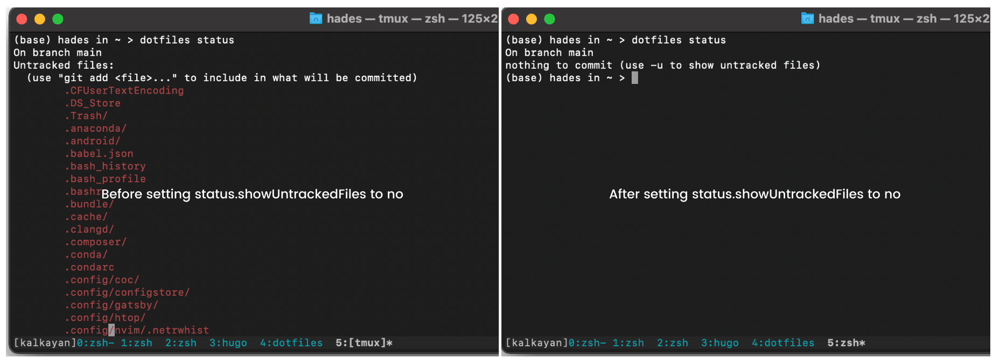

Customizing an operating system has always fascinated programmers. There are tons of great articles out there with great customization tips. Most of these articles use dotfiles for customization, and these simple invisible files may seem pointless for a novice. But, they become a swiss army knife if properly configured. 

Personalizing a system takes a lot of time and hard work, and nobody wishes to do it over and over again. Setting up a machine with a preferred setting should be done in minimal steps and without writing any code. I've divided this process into two parts: sharing dotfiles and writing an automated script. 

This article will discuss an elegant way to manage, modify, and share dotfiles across multiple devices using a single `git` repository.

# Managing and tracking [dot]files

The majority of developers use `git` to manage and share these files and use `symlinks` to sync them. Well, `symlinks` works, but it isn't the best way to sync your local files to the git repository. There are a good number of issues on [StackOverflow](https://stackoverflow.com/questions/46534290/symlink-dotfiles/64548852#64548852), pointing issues with dotfiles and symlinks. There is a much better solution to this, written by people at Atlassian -- [The best way to store your dotfiles: A bare Git repository ](https://www.atlassian.com/git/tutorials/dotfiles).

The trick to managing these dotfiles is by creating a [bare](https://www.atlassian.com/git/tutorials/setting-up-a-repository/git-init) git repository. If you start from scratch, make a `bare` repository in the `$HOME` directory. 

```bash
# notice the --bare flag; this initializes the repository as a git bare
git init --bare $HOME/.dotfiles
```

Bare repositories are special in a way that they omit the working directory. Therefore, we need to define a work tree and git directory for the repository. The `--work-tree` is set to $HOME directory (since dotfiles live there) and `--git-dir` to `$HOME/.dotfiles` (this is our repository location). Our command to use the repository has the prefix `git --work-dir $HOME --git-dir $HOME/.dotfiles`

To make it easier to use, we alias this to `dotfiles`, which we will use to interact with our dotfiles repository.

```bash
alias dotfiles="/usr/bin/git --git-dir=$HOME/.dotfiles --work-tree=$HOME"
```

**Thats it!** We are good to track our dotfiles using the dotfiles command. Some of the examples are:
```bash
# to check the version history 
dotfiles log

# to check the status of the tracked and untracked files 
dotfiles status

# to add a file for tracking
dotfiles commit .vimrc -m ".vimrc added"

# push new files or changes to the github
dotfiles push origin main
```


If we look at the output of `dotfiles status`, We can see all files under `$HOME` directory are coming under untracked files (see the left side of screenshot below). We clearly don't want this behavior, and to fix this behavior, we modify the dotfiles repository status configs like below:

```
# hides all the untracked files when status command is called
dotfiles config status.showUntrackedFiles no
```

<!--  -->

# Advantages and Use Cases

Besides easier management and sharing, this method has various other advantages like:

### Easy setup

Setting up a new machine can be a time-consuming task, But with this method, we can use our personalized configs in under a minute. 
We just need to clone the repository and source the `.bashrc` or `.zshrc` file.

```bash
git clone --bare https://github.com/<username>/dotfiles.git $HOME/.dotfiles && source ~/.zshrc
```

### Versioned dotfiles 

Best for experimenting with new configurations and keep the change history (Basically all the pros of using git)

```bash
# to check the version history 
dotfiles log
```

### Share on Multiple devices

Share the same configs of multiple devices with minimal changes using **git branches**. Create a branch for your new machine, example:-

```bash
# Create configurations specific to your aws machines
dotfiles checkout -b aws
```

### Profiles for dotfiles

Create configs based on your environment using `branch`, create a branch and configure according to you work env.

```bash
# Manage multiple profiles - check out to the work profile 
dotfiles checkout work
```

# 

We completed the first part of our tooling setup, next read - [Automate the setup of your development machine](/posts/automated-setup/).