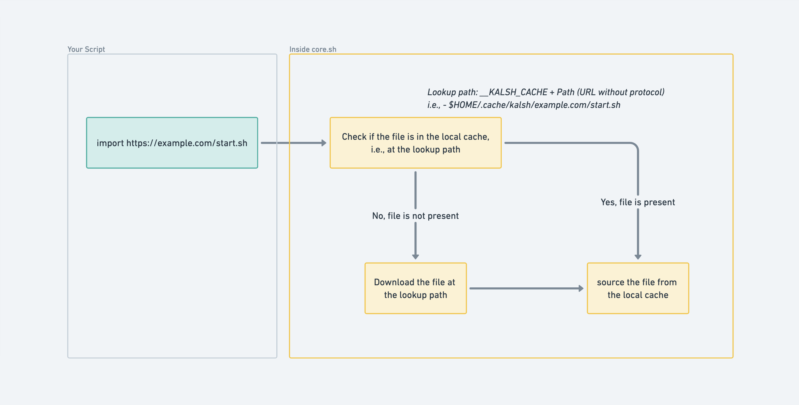

You may be new to using a shell and have little experience writing automation scripts, or you are a seasoned veteran with a great script to set up your machines. Either way, this piece will introduce a new way of automating the setup and other tasks. And hopefully, you will have a different perspective on this subject and significantly shorter automation scripts by the end of this article. 

# The tool of the wise 

Automation scripts are concise, highly targeted code written to reduce time-consuming tasks such as building a codebase, performing testing, setting up a development machine, and other repetitive work into a single command. Many developers use scripts to set up and configure their development machines. These are so prevalent that there are thousands of similar setup scripts on GitHub for macOS alone. 

This popularity among developers stems from the fact that these scripts save time and effort while also being an excellent approach to assure installation consistency when done repeatedly.

# What seems to be the problem, officer?

You may wonder what problems can there be with scripts that claim to be so efficient? The problems are not with the scripts per se but are in our way of using them. With every new developer joining the scripting herd, we continuously write and host too much duplicative and redundant code.

When writing your setup script, you will often notice that you directly copy a part of someone's code into your script or paraphrase the code if you got time. If you think about it, all those thousands of scripts on GitHub virtually perform the same tasks, i.e., install XCode, apps, set defaults, etc. It wouldn't be wrong to say that they are primarily similar, and we can reduce this redundancy if we can have a standard script that other developers can use directly.

Furthermore, writing more code requires more maintenance and time. It may be the case that maintaining scripts takes more time than what they were supposed to save. 

# I've missed the plan part of the plan

I'm sure by now, you know where the article is going, but let me brief the plan for this. To solve our redundancy problem, first, we must understand what is there in a typical system setup. Regardless of the operating system, this process broadly installs the following: language support (GCC, Clang), build tools, a package manager, libraries, binaries, frameworks, applications, and a few customizations tailored to your needs and type of work. The ninety percent of the setup scripts except the last remain the same for all developers and can be easily generalized and standardized. The script only differs at the end, where it performs operations that are well suited for a developer's needs. So, can we agree that we can remove 90 percent of the redundant code? 

# Work the problem, people.

We tend to use modules(packages) and import whenever repetitive work, which is very common in the real world. Modules or packages are the best design features a language can have, and they come out of the box in languages with sound design. Languages that didn't include modules in the original designs also realize this and are in the process of adding. C++ is introducing modules in its v20 release. But, Unfortunately, this is not the course for the scripting language. This little experiment plans to introduce a module feature to our existing scripting language, which should be good enough to solve our problem. 

We will start with something straightforward: we will consider a script file a single module, and we want a way to import it to other scripts (or script modules). We want to support all the perks of sourcing a local script for a remote script allowing us to use functions and variables in the new script. This eliminates all this redundant work we need to do.

We don't need to do anything for the first part of our solution. We can directly consider a script as a module without introducing any keyword like package, export, or module. Not changing the original script maintains backward compatibility and is an essential factor here. For the second part of the solution, we introduce an import keyword, which will take a few parameters (module's name, location, etc.) and would work as explained in the following workflow diagram. 



# Show me how it's done

I have written an effortless script [core.sh](https://sh.kalkayan.io/config/sh/core) that enables `import` right out of the box. Attach the following code in the starting to use `core.sh` in your script.

```bash 
[ -f $HOME/.config/sh/core  ] && source $HOME/.config/sh/core \
                              || source /dev/stdin <<< "$(curl https://sh.kalkayan.io/config/sh/core)"
```
This source `core.sh` file in your script from `.config/sh/` folder or the [URL](https://sh.kalkayan.io/config/sh/core). The `core.sh` exposes the import functionality to your script. Now, you can directly import and use any script from the internet, and the overall code looks like 

```bash
# Bring the import functionality for this script
[ -f $HOME/.config/sh/core  ] && source $HOME/.config/sh/core \
                              || source /dev/stdin <<< "$(curl https://sh.kalkayan.io/config/sh/core)"

# Import scripts (utils.sh script has macOS setup utilities )
import https://sh.kalkayan.io/config/zsh/utils.sh

# Rest of your script (you can directly use functions from utils.sh in this script)
install_xcode
```

# This is still too much work. Delete the script, delete it, delete it.

I got you. If you don't want to write that also, you are welcome to use my setup script. There are two ways to do this: first install everything 
```
curl -fsSL https://sh.kalkayan.io/setup | zsh -s -- --new-machine
```

If you want more control with what you are installing then (Assume you have my kind of dotfiles or you are providing --with-dotfiles)
```bash
curl -fsSL https://sh.kalkayan.io/setup | zsh -s -- --with-dotfiles      \
                                                    --install-buildtools \
                                                    --install-brew       \
                                                    --install-bins       \
                                                    --install-casks
```


<!-- # The Grievances  -->

Thanks for the read. If you have any thoughts on this, or just want to say hi, feel free to reach out to me at rec.manish.sahani@gmail.com or connect on LinkedIn.